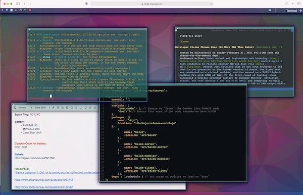

# Diaplode
Multi user general purpose remote workspace built using the Balek Framework. Includes WYSIWYG and text editors, terminal and other modules.

To be released here once [pre alpha conditions](./PAC.md) are met

## For the adventurous

Currently living [here](https://github.com/ephedrandrox/balek/tree/diaplode-main) in a pre-pre-alpha multiple branch state
